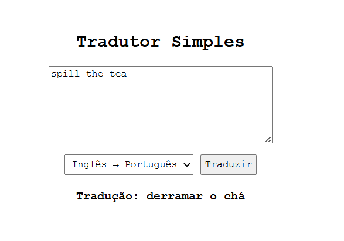

**PP.1.11.** Exemplifique a utilização de uma biblioteca de tradução de texto, do inglês para o português (ou do português para o inglês). Construa um sistema simples onde o usuário digita uma frase e, a seguir, retornado o texto traduzido. Na resolução desse exercício, ilustre uma situação onde pode ser verificado um problema de operação da biblioteca.

Passo a passo da utilização:

1. Ter Python3 instalado no computador
2. Clonar esse repositório
```
git clone https://github.com/gabidsbarbosa/pln.git
```
3. Entrar na pasta desse projeto pelo terminal
```
cd pp_1-11
```
4. Instalar as bibliotecas necessárias para o projeto
```
pip install -r requirements.txt
```
5. Rodar o app.py
```
python app.py
```
6. Abrir o arquivo .html no navegador
7. Usar o tradutor


#### Possível problema na operação da biblioteca:



"Spill the tea" na tradução literal do inglês para o português é realmente "Derramar o chá". Porém, essa frase se tornou uma gíria para "Contar uma fofoca". Então, um possível problema que um aplicativo de tradução pode encontrar é o quão literal o usuário deseja essa tradução, se ele quer o significado literal da frase ou algo mais coloquial.